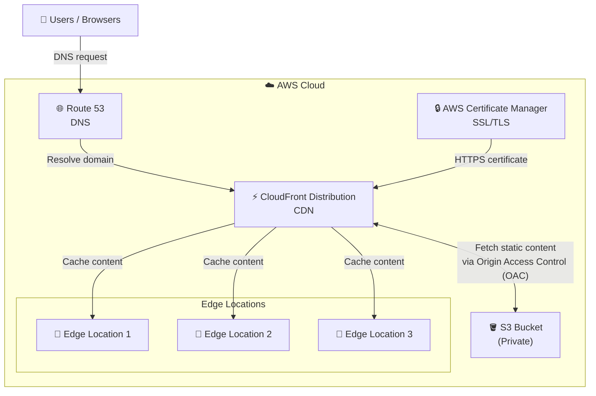

# Static Website Hosting with S3 and CloudFront

A production-ready, secure architecture for hosting static websites on AWS using S3 and CloudFront, deployed with Terraform.

## Architecture Overview



## What This Architecture Includes

### Core Components

- **S3 Bucket (Private)**: Stores static website files with no public access
- **CloudFront Distribution**: Global CDN for fast content delivery with edge caching
- **Origin Access Control (OAC)**: Secure access from CloudFront to S3 (replaces legacy OAI)
- **Route 53**: DNS management for custom domain
- **AWS Certificate Manager**: Free SSL/TLS certificates for HTTPS

### Security Features

-  S3 bucket is private (not publicly accessible)
-  Content served exclusively through CloudFront
-  HTTPS enforced with automatic certificate management
-  Origin Access Control prevents direct S3 access
-  Bucket policies restrict access to CloudFront only

### Performance Features

- Global edge locations for low-latency content delivery
- Automatic caching at edge locations
- HTTP/2 and HTTP/3 support
- Gzip and Brotli compression
- Custom cache behaviors and TTLs

## Terraform Resources

This Terraform configuration will provision:

| Resource | Purpose |
|----------|---------|
| `aws_s3_bucket` | Private bucket for static website files |
| `aws_s3_bucket_public_access_block` | Block all public access |
| `aws_s3_bucket_versioning` | Enable versioning for rollback capability |
| `aws_cloudfront_distribution` | CDN distribution with custom domain |
| `aws_cloudfront_origin_access_control` | Secure S3 access |
| `aws_s3_bucket_policy` | Allow CloudFront OAC access only |
| `aws_route53_record` | DNS A record pointing to CloudFront |
| `aws_acm_certificate` | SSL/TLS certificate (us-east-1) |
| `aws_acm_certificate_validation` | Automatic DNS validation |

## Prerequisites

- AWS CLI configured with appropriate credentials
- Terraform >= 1.0
- A registered domain (for Route 53 and ACM)
- Hosted zone in Route 53

## Usage

### 1. Initialize Terraform

```bash
terraform init
```

### 2. Configure Variables

Create a `terraform.tfvars` file:

```hcl
domain_name     = "example.com"
bucket_name     = "my-static-website-bucket"
aws_region      = "us-east-1"
environment     = "production"
```

### 3. Plan and Apply

```bash
terraform plan
terraform apply
```

### 4. Upload Website Files

```bash
aws s3 sync ./website/ s3://your-bucket-name/ --delete
```

### 5. Invalidate CloudFront Cache (if needed)

```bash
aws cloudfront create-invalidation \
  --distribution-id YOUR_DISTRIBUTION_ID \
  --paths "/*"
```

## File Structure

```
static-website-cloudfront-s3/
├── main.tf              # Main Terraform configuration
├── variables.tf         # Input variables
├── outputs.tf           # Output values
├── providers.tf         # Provider configuration
├── s3.tf               # S3 bucket resources
├── cloudfront.tf       # CloudFront distribution
├── route53.tf          # DNS configuration
├── acm.tf              # SSL certificate
├── README.md           # This file
└── terraform.tfvars    # Variable values (gitignored)
```

## Key Design Decisions

### Why Origin Access Control (OAC) over OAI?

OAC is AWS's newer, more secure method that:
- Supports all S3 buckets (including SSE-KMS encrypted)
- Works with S3 in all regions
- Provides better security through SigV4 signing
- OAI is being phased out by AWS

### Why CloudFront Distribution?

- Global content delivery with low latency
- HTTPS termination at edge locations
- DDoS protection via AWS Shield Standard
- Cost-effective compared to serving from S3 directly
- Better performance for global users

## Cost Optimization

- CloudFront has a generous free tier (1TB transfer, 10M requests/month)
- S3 costs are minimal for static sites
- Route 53 hosted zone: ~$0.50/month
- ACM certificates are free
- No EC2 or server costs

**Estimated monthly cost for low-traffic site**: $1-5

## Security Best Practices Implemented

1. **Principle of Least Privilege**: S3 bucket policy allows only CloudFront OAC
2. **Encryption in Transit**: HTTPS enforced on CloudFront
3. **Encryption at Rest**: S3 server-side encryption enabled
4. **No Public Access**: All public access blocked on S3 bucket
5. **Resource Tagging**: All resources tagged for governance

## Cleanup

To destroy all resources:

```bash
# Empty the S3 bucket first
aws s3 rm s3://your-bucket-name/ --recursive

# Destroy infrastructure
terraform destroy
```

## Future Enhancements

- [ ] Add CloudFront Functions for request/response manipulation
- [ ] Implement Lambda@Edge for dynamic content generation
- [ ] Add WAF rules for additional security
- [ ] Set up CloudWatch alarms for monitoring
- [ ] Add CI/CD pipeline for automated deployments
- [ ] Implement blue-green deployments
- [ ] Add CloudFront access logs to S3

## References

- [AWS CloudFront Documentation](https://docs.aws.amazon.com/cloudfront/)
- [S3 Static Website Hosting](https://docs.aws.amazon.com/AmazonS3/latest/userguide/WebsiteHosting.html)
- [CloudFront Origin Access Control](https://docs.aws.amazon.com/AmazonCloudFront/latest/DeveloperGuide/private-content-restricting-access-to-s3.html)
- [Terraform AWS Provider](https://registry.terraform.io/providers/hashicorp/aws/latest/docs)
