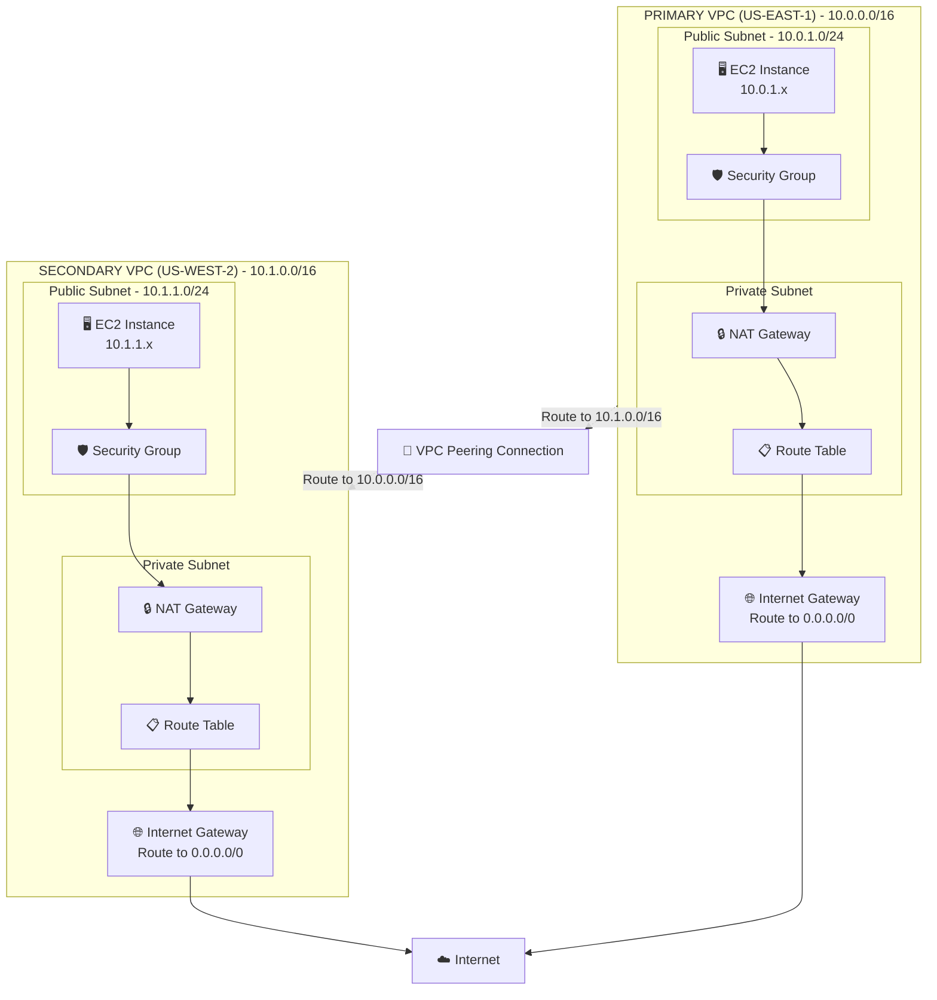

# VPC with Public and Private Subnets

A production-ready, multi-AZ VPC architecture with public and private subnets, NAT gateways, and VPC peering capability, deployed with Terraform.

## Architecture Overview



## What This Architecture Includes

### Core Components

- **Two VPCs in Different Regions**: Primary (us-east-1) and Secondary (us-west-2)
- **Public Subnets**: Host resources that need direct internet access
- **Private Subnets**: Host resources without direct internet access
- **NAT Gateways**: Allow private subnet resources to access internet
- **Internet Gateways**: Enable public subnet internet connectivity
- **VPC Peering**: Private connectivity between VPCs across regions
- **Route Tables**: Manage traffic routing for subnets
- **Security Groups**: Stateful firewall rules for EC2 instances

### Network Architecture

#### Primary VPC (us-east-1)
- **VPC CIDR**: 10.0.0.0/16
- **Public Subnet**: 10.0.1.0/24
- **Private Subnet**: 10.0.2.0/24
- **Availability**: Multi-AZ deployment

#### Secondary VPC (us-west-2)
- **VPC CIDR**: 10.1.0.0/16
- **Public Subnet**: 10.1.1.0/24
- **Private Subnet**: 10.1.2.0/24
- **Availability**: Multi-AZ deployment

### Security Features

- ✅ Public/Private subnet segregation
- ✅ Security groups with least-privilege access
- ✅ Network ACLs for subnet-level protection
- ✅ Private subnets have no direct internet access
- ✅ VPC Flow Logs for network monitoring
- ✅ Encrypted VPC peering connections

### High Availability Features

- 🔄 Multi-AZ deployment for fault tolerance
- 🔄 NAT Gateways in each AZ
- 🔄 Cross-region VPC peering for disaster recovery
- 🔄 Redundant internet gateways

## Terraform Resources

This Terraform configuration will provision:

| Resource | Purpose |
|----------|---------|
| `aws_vpc` | Primary and secondary VPCs |
| `aws_subnet` | Public and private subnets in each AZ |
| `aws_internet_gateway` | Internet access for public subnets |
| `aws_nat_gateway` | Internet access for private subnets |
| `aws_eip` | Elastic IPs for NAT gateways |
| `aws_route_table` | Public and private route tables |
| `aws_route_table_association` | Associate subnets with route tables |
| `aws_vpc_peering_connection` | Connect VPCs across regions |
| `aws_vpc_peering_connection_accepter` | Accept peering requests |
| `aws_route` | Routes for internet and VPC peering |
| `aws_security_group` | Firewall rules for EC2 instances |
| `aws_network_acl` | Subnet-level network access control |
| `aws_flow_log` | VPC traffic logging |

## Prerequisites

- AWS CLI configured with appropriate credentials
- Terraform >= 1.0
- AWS account with permissions to create VPCs
- Two AWS regions configured (us-east-1 and us-west-2)

## Usage

### 1. Initialize Terraform

```bash
terraform init
```

### 2. Configure Variables

Create a `terraform.tfvars` file:

```hcl
# Primary VPC Configuration
primary_vpc_cidr            = "10.0.0.0/16"
primary_vpc_region          = "us-east-1"
primary_public_subnet_cidr  = "10.0.1.0/24"
primary_private_subnet_cidr = "10.0.2.0/24"

# Secondary VPC Configuration
secondary_vpc_cidr            = "10.1.0.0/16"
secondary_vpc_region          = "us-west-2"
secondary_public_subnet_cidr  = "10.1.1.0/24"
secondary_private_subnet_cidr = "10.1.2.0/24"

# General Configuration
environment = "production"
project_name = "multi-region-vpc"

# Enable VPC Peering
enable_vpc_peering = true

# Enable VPC Flow Logs
enable_flow_logs = true
```

### 3. Plan and Apply

```bash
terraform plan
terraform apply
```

### 4. Test Connectivity

```bash
# SSH to instance in primary VPC
aws ec2 describe-instances --region us-east-1 --filters "Name=tag:Name,Values=primary-vpc-instance"

# Test VPC peering connectivity
ssh ec2-user@<primary-instance-ip>
ping <secondary-instance-private-ip>
```

## File Structure

```
vpc-public-private/
├── main.tf                    # Main Terraform configuration
├── variables.tf               # Input variables
├── outputs.tf                 # Output values
├── providers.tf               # Multi-region provider configuration
├── vpc-primary.tf            # Primary VPC resources
├── vpc-secondary.tf          # Secondary VPC resources
├── peering.tf                # VPC peering configuration
├── security-groups.tf        # Security group rules
├── network-acls.tf           # Network ACL rules
├── flow-logs.tf              # VPC flow logs configuration
├── README.md                 # This file
└── terraform.tfvars          # Variable values (gitignored)
```

## Key Design Decisions

### Why Public and Private Subnets?

**Public Subnets** for:
- Load balancers
- Bastion hosts
- NAT gateways
- Resources that need direct internet access

**Private Subnets** for:
- Application servers
- Databases
- Internal services
- Sensitive workloads

This separation provides defense-in-depth security.

### Why NAT Gateways?

- Allow private subnet resources to download updates and patches
- Prevent inbound internet connections to private resources
- AWS-managed, highly available service
- Better security than NAT instances

### Why VPC Peering?

- Private connectivity between VPCs (traffic never traverses internet)
- Lower latency than VPN connections
- No single point of failure
- Cost-effective for inter-VPC communication
- Supports cross-region peering for DR scenarios

### Why Multi-AZ?

- High availability and fault tolerance
- Automatic failover capabilities
- Better resilience against AZ failures
- Required for production workloads

## Routing Tables Explained

### Public Subnet Route Table

| Destination | Target | Purpose |
|-------------|--------|---------|
| 10.0.0.0/16 | local | Intra-VPC traffic |
| 10.1.0.0/16 | pcx-xxx | Traffic to peered VPC |
| 0.0.0.0/0 | igw-xxx | Internet traffic |

### Private Subnet Route Table

| Destination | Target | Purpose |
|-------------|--------|---------|
| 10.0.0.0/16 | local | Intra-VPC traffic |
| 10.1.0.0/16 | pcx-xxx | Traffic to peered VPC |
| 0.0.0.0/0 | nat-xxx | Outbound internet via NAT |

## Security Group Rules

### Public Instance Security Group

**Inbound Rules:**
- Port 22 (SSH) from your IP
- Port 80 (HTTP) from 0.0.0.0/0
- Port 443 (HTTPS) from 0.0.0.0/0
- ICMP from peered VPC CIDR

**Outbound Rules:**
- All traffic to 0.0.0.0/0

### Private Instance Security Group

**Inbound Rules:**
- Port 22 (SSH) from public subnet
- Application ports from public subnet
- All traffic from peered VPC CIDR

**Outbound Rules:**
- All traffic to 0.0.0.0/0 (via NAT)

## Cost Optimization

### Monthly Cost Estimates (us-east-1)

- **VPC**: Free
- **Subnets**: Free
- **Internet Gateway**: Free
- **NAT Gateway**: ~$32/month (per AZ)
- **NAT Gateway Data Processing**: $0.045/GB
- **VPC Peering**: Free (data transfer charges apply)
- **Data Transfer (cross-region)**: $0.02/GB
- **Elastic IPs**: Free (when attached)
- **VPC Flow Logs**: S3 storage costs only

**Estimated monthly cost**: $65-100 (depending on data transfer)

### Cost Optimization Tips

1. Use a single NAT Gateway per VPC for dev/test (not recommended for production)
2. Use VPC endpoints for AWS services to avoid NAT Gateway data charges
3. Archive old VPC Flow Logs to Glacier
4. Use S3 VPC endpoint for S3 traffic (free)

## Network Access Control Lists (NACLs)

### Public Subnet NACL

**Inbound:**
- Allow HTTP (80) from 0.0.0.0/0
- Allow HTTPS (443) from 0.0.0.0/0
- Allow SSH (22) from your IP
- Allow ephemeral ports (1024-65535)
- Allow ICMP from peered VPC

**Outbound:**
- Allow all traffic

### Private Subnet NACL

**Inbound:**
- Allow traffic from VPC CIDR
- Allow ephemeral ports from 0.0.0.0/0
- Allow traffic from peered VPC CIDR

**Outbound:**
- Allow all traffic

## VPC Flow Logs

Flow logs capture information about IP traffic:

```hcl
# Example flow log record
2 123456789010 eni-abc123de 172.31.16.139 172.31.16.21 20641 22 6 20 4249 1418530010 1418530070 ACCEPT OK
```

**Use cases:**
- Troubleshoot connectivity issues
- Security analysis and threat detection
- Monitor traffic patterns
- Compliance and auditing

## Testing the Architecture

### 1. Test Internet Connectivity from Public Subnet

```bash
# SSH to public instance
ssh ec2-user@<public-ip>

# Test internet access
curl -I https://www.google.com
```

### 2. Test Internet Connectivity from Private Subnet

```bash
# SSH to private instance via bastion/public instance
ssh -J ec2-user@<public-ip> ec2-user@<private-ip>

# Test internet access (should work via NAT Gateway)
curl -I https://www.google.com

# Note: Private instance has no public IP
```

### 3. Test VPC Peering

```bash
# From primary VPC instance
ping <secondary-vpc-private-ip>

# From secondary VPC instance
ping <primary-vpc-private-ip>
```

## Cleanup

To destroy all resources:

```bash
# Terminate any running EC2 instances first
aws ec2 terminate-instances --instance-ids <instance-id>

# Destroy infrastructure
terraform destroy
```

**⚠️ Warning**: This will delete:
- All VPCs
- NAT Gateways
- Elastic IPs
- Peering connections
- Flow logs

## Common Issues and Solutions

### Issue: VPC Peering Not Working

**Solution:**
- Check route tables have peering routes
- Verify security groups allow traffic from peer VPC CIDR
- Ensure CIDR blocks don't overlap
- Check NACLs aren't blocking traffic

### Issue: Private Subnet Can't Access Internet

**Solution:**
- Verify NAT Gateway is in public subnet
- Check NAT Gateway has Elastic IP
- Verify private route table points to NAT Gateway
- Ensure public subnet route table has IGW route

### Issue: High NAT Gateway Costs

**Solution:**
- Use VPC endpoints for AWS services
- Consolidate to fewer NAT Gateways (with reduced HA)
- Review and optimize data transfer patterns

## Security Best Practices Implemented

1. **Network Segmentation**: Public/private subnet isolation
2. **Principle of Least Privilege**: Minimal security group rules
3. **Defense in Depth**: Security groups + NACLs
4. **Monitoring**: VPC Flow Logs enabled
5. **No Public IPs on Private Resources**: Private subnets don't auto-assign public IPs
6. **Encrypted Transit**: VPC peering traffic is private
7. **Multi-AZ**: High availability and fault tolerance

## Future Enhancements

- [ ] Add Transit Gateway for multi-VPC connectivity
- [ ] Implement AWS PrivateLink for service connectivity
- [ ] Add VPN connection for hybrid cloud
- [ ] Set up VPC endpoints for AWS services (S3, DynamoDB, etc.)
- [ ] Implement AWS Network Firewall
- [ ] Add GuardDuty for threat detection
- [ ] Configure CloudWatch alarms for VPC metrics
- [ ] Implement automated IP address management (IPAM)
- [ ] Add AWS Direct Connect for dedicated connectivity
- [ ] Set up Site-to-Site VPN as backup to Direct Connect

## Use Cases

This architecture is ideal for:

- **Multi-tier applications** (web, app, database tiers)
- **Microservices** requiring network isolation
- **Hybrid cloud** setups with on-premises connectivity
- **Multi-region deployments** with cross-region replication
- **Compliance workloads** requiring network segmentation
- **Development/staging environments** isolated from production

## References

- [AWS VPC Documentation](https://docs.aws.amazon.com/vpc/)
- [VPC Peering Guide](https://docs.aws.amazon.com/vpc/latest/peering/what-is-vpc-peering.html)
- [NAT Gateways](https://docs.aws.amazon.com/vpc/latest/userguide/vpc-nat-gateway.html)
- [VPC Flow Logs](https://docs.aws.amazon.com/vpc/latest/userguide/flow-logs.html)
- [Terraform AWS VPC Module](https://registry.terraform.io/modules/terraform-aws-modules/vpc/aws/latest)
